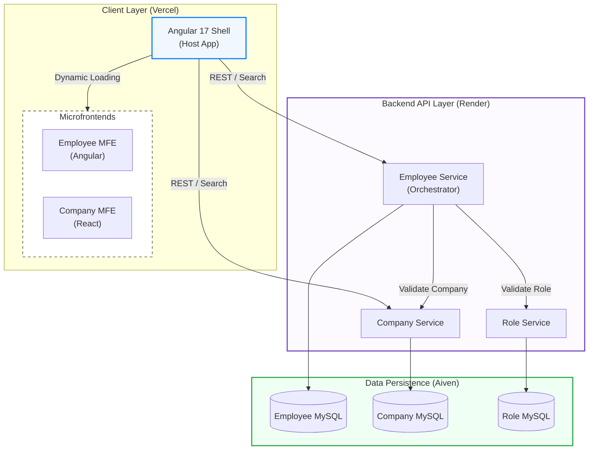

# 🏢 Office Management System

> **Advanced Microservices + Microfrontends Architecture** for Enterprise Applications

A full-stack enterprise ecosystem demonstrating modern architecture patterns with independently deployable Node.js microservices and polyglot frontend modules (Angular & React) seamlessly integrated via Webpack Module Federation.

---

## 🎯 Project Overview

This project showcases:

- **Backend**: Microservices architecture with Express.js and MySQL (Aiven.io).
- **Frontend**: Microfrontend architecture with Angular (Shell & Employee MFE) and React (Company MFE) using **Module Federation**.
- **Database**: Database-per-service pattern with MySQL 8.0+.
- **DevOps**: Fully cloud-deployed on **Render** (Backend) and **Vercel** (Frontend).
- **Patterns**: Inter-service communication, polyglot frontend, and independent scalability.

**Status:** ✅ Project Fully Functional & Deployed

---

## 🏗️ System Architecture

The following diagram illustrates the high-level integration between the infrastructure layers and the data flow between services:



---

## 🛠️ Tech Stack

### 🚀 Backend (Microservices)

| Component   | Technology | Version | Key Details                   |
| ----------- | ---------- | ------- | ----------------------------- |
| Runtime     | Node.js    | v20+    | Fast server-side execution    |
| Framework   | Express.js | 4.x     | Lightweight Web API framework |
| Database    | MySQL      | 8.0+    | Relational data management    |
| Validation  | Joi        | 17.x    | Schema-based body validation  |
| HTTP Client | Axios      | 1.6+    | Inter-service communication   |

### 🎨 Frontend (Microfrontends)

| Component        | Technology        | Version | Key Details                    |
| ---------------- | ----------------- | ------- | ------------------------------ |
| **Shell**        | Angular           | 17      | Orchestrates MFE loading       |
| **Employee MFE** | Angular           | 17      | Shared Angular components      |
| **Company MFE**  | React             | 18      | Vite-based React module        |
| **Bridges**      | Module Federation | -       | Real-time lazy loading of MFEs |
| **Styling**      | Tailwind CSS      | 3.4+    | Utility-first modern UI        |

### ☁️ Deployment

- **Databases**: [Aiven.io](https://aiven.io/) (MySQL Free Tier)
- **Backend**: [Render](https://render.com/) (Web Services)
- **Frontend**: [Vercel](https://vercel.com/) (CI/CD)

---

## 🚀 Local Quick Start

### 1. Database Setup

Choose one of the following:

- **Docker**: Run `cd database && docker-compose up -d`.
- **Manual**: Create `company_db`, `employee_db`, and `role_db` in MySQL and run scripts in `database/schemas/` and `database/seeds/`.

### 2. Backend Services

In 3 separate terminals:

```bash
# Company Service
cd backend/company-service && npm install && npm run dev

# Role Service
cd backend/role-service && npm install && npm run dev

# Employee Service
cd backend/employee-service && npm install && npm run dev
```

### 3. Frontend Apps

In 3 separate terminals:

```bash
# Shell Application (Port 4200)
cd frontend/shell-app && npm install && npm start

# Employee MFE (Port 4201)
cd frontend/employee-mfe && npm install && npm start

# Company MFE (Port 4202)
cd frontend/company-mfe && npm install && npm run dev
```

Visit **`http://localhost:4200`** to see the integrated system.

---

## � Project Structure

```text
office-management-system/
├── backend/                  # Node.js Microservices
│   ├── company-service/      # Reacts to Company data (Port 3001)
│   ├── employee-service/     # Main logic + Inter-service calls (Port 3002)
│   └── role-service/         # Manages Roles (Port 3003)
├── frontend/                 # Microfrontends
│   ├── shell-app/            # Angular Shell (The Orchestrator)
│   ├── employee-mfe/         # Angular-based Employee module
│   └── company-mfe/          # React-based Company module
└── database/                 # SQL Schemas & Seeds
    ├── schemas/              # Table definitions
    └── seeds/                # Initial demo data
```

---

## 🛠️ Troubleshooting Methodology

If you encounter issues during setup or runtime, follow these steps:

### 1. Database Connection Errors

- **Symptom**: `Error: Connect ETIMEDOUT` or `Access denied`.
- **Fix**: Ensure your `DB_HOST` and credentials in the `.env` file match your Aiven/local MySQL settings. Check if your IP is whitelisted on Aiven.

### 2. Frontend "Remote Not Found"

- **Symptom**: Dashboard loads but "Companies" or "Employees" tabs show an error.
- **Fix**: Verify that the MFE services (Ports 4201 and 4202) are actually running. Check the browser console for CORS or network errors.

### 3. Dependency Conflicts (ERESOLVE)

- **Symptom**: `npm install` fails with version mismatch.
- **Fix**: Ensure you are using the versions specified in the `package.json`. Use `npm install --legacy-peer-deps` if you encounter strict peer dependency issues on older Node versions.

### 4. Inter-Service Communication Failures

- **Symptom**: Employee creation fails even with valid data.
- **Fix**: Ensure `company-service` and `role-service` are running and reachable by the `employee-service`. Check the `COMPANY_SERVICE_URL` in the employee service `.env`.

---

## �🔒 Key Features Demonstrated

- ✅ **Polyglot Frontend**: Mixing Angular and React in a single seamless user experience.
- ✅ **Runtime Integration**: MFEs are loaded on-demand using Module Federation, keeping initial bundle size small.
- ✅ **Service Independence**: If the Company service is down, the Employee service still functions for cached or unrelated data.
- ✅ **Stateless UI**: The Shell app maintains zero backend state, relying entirely on the microservice APIs.

---
